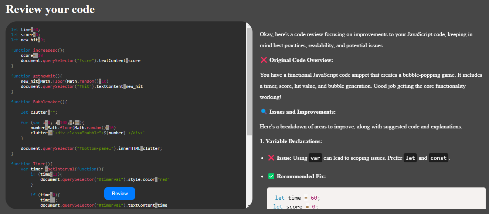

# Code Reviewer : Review your code with AI

Code Reviewer is an AI-powered code review tool that uses Google's Gemini API to analyze code and provide improvement suggestions. It features syntax highlighting and presents reviews in a clean Markdown format.

Key benefits:
- Instant code feedback
- Bug detection
- Best practices guidance
- Pre-review quality checks

## Tech Stack

- React
- Node.js
- Express
- Google Gemini API
- Rehype Highlight
- Highlight.js
- React Markdown

## Features

- Review your code with AI
- Highlights the code with Highlight.js
- Shows the review in Markdown format

## Run the project

- Clone the repository
- Run `cd Backend`
- Run `npm install`
- Run `npm start`

In a new terminal, run:

- Run `cd Frontend`
- Run `npm install`
- Run `npm run dev`

## Environment Variables

To run this project, you will need to add the following environment variables to your .env file in the Backend directory:

`GOOGLE_API_KEY` - Your Google Gemini API key

## Screenshots

## License

This project is licensed under the MIT License - see the [LICENSE](LICENSE) file for details.

## Support

For support, visit my [Github](https://github.com/c0d1ngthunder) or [LinkedIn](https://www.linkedin.com/in/nitish-thedev/)

## Acknowledgements

- [Google Gemini API](https://ai.google.dev/)
- [React Documentation](https://react.dev/)
- [Express Documentation](https://expressjs.com/)
- [Highlight.js](https://highlightjs.org/)
- [React Markdown](https://remarkjs.github.io/react-markdown/)

## Feedback

If you have any feedback or suggestions, please reach out to me through:
- Creating an issue on [GitHub](https://github.com/c0d1ngthunder/code-reviewer/issues)
- Connecting with me on [LinkedIn](https://www.linkedin.com/in/nitish-thedev/)

---

  Made with ❤️ by Nitish Kumar

   

  
  
  

